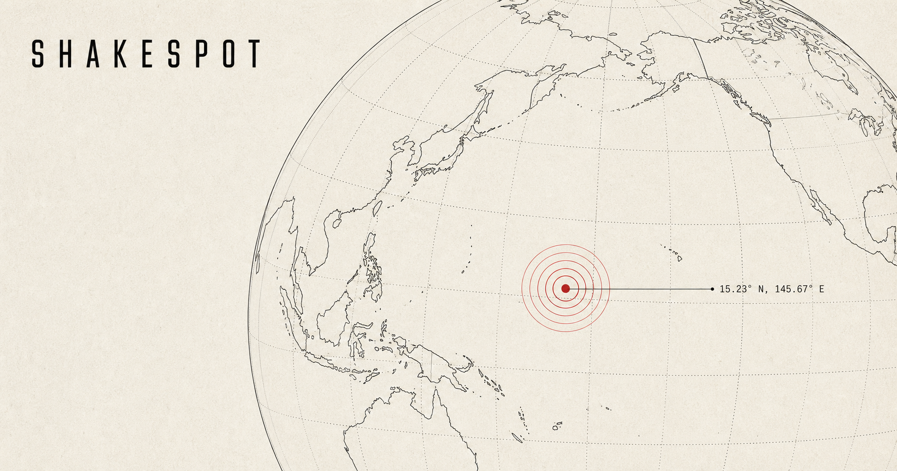
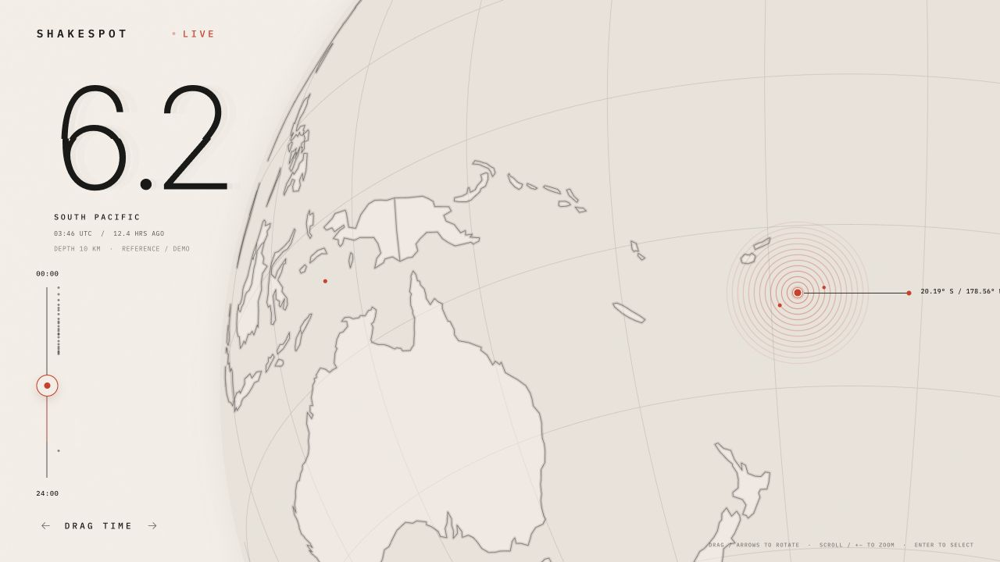
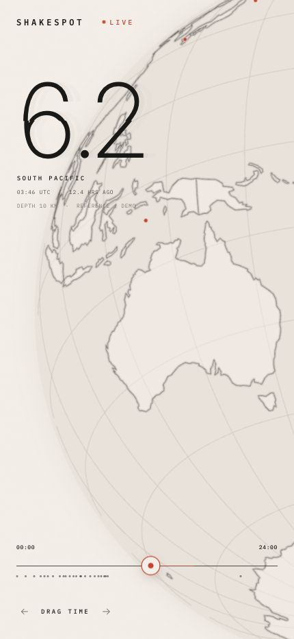

# Shakespot

A quiet, slightly dramatic live view of earthquakes around the planet.



Shakespot pulls the latest 24-hour earthquake feed from USGS and lays it over an interactive canvas globe. Pick an event, scrub through the day, or leave it open and let the Earth drift a little. The idle rotation is deliberately slow becuase a totally frozen planet felt kinda off.

## What it does

- Plots recent USGS earthquakes on a rotatable globe
- Shows magnitude, depth, coordinates, event age, and location in one focused readout
- Lets you scrub across the last 24 hours and step between events
- Adds inertial dragging, animated quake pulses, and small interface reactions without turning the page into a light show
- Works with a mouse, touch, or keyboard and respects reduced-motion settings
- Falls back to clearly labelled demo events if the live feed cannot be reached

## A closer look



<p align="center">
  
</p>

## Built with

- React 19 and Vite
- The Canvas API for the globe renderer
- `world-atlas` and `topojson-client` for country geometry
- The [USGS Earthquake GeoJSON feed](https://earthquake.usgs.gov/earthquakes/feed/v1.0/summary/all_day.geojson)
- IBM Plex Mono, Inter Tight, and Phosphor icons

There is no map service key to configure.

## Run it locally

You will need a recent Node.js release and pnpm 11.

```bash
pnpm install
pnpm dev
```

Vite prints the local address in the terminal, usually [localhost:5173](http://localhost:5173).

To make a production build and check the site worker:

```bash
pnpm build
pnpm test:sites
```

## Controls

| Action | Control |
| --- | --- |
| Rotate the globe | Drag, or use the arrow keys |
| Zoom | Scroll, or use `+` / `-` |
| Select a quake | Click a marker or press `Enter` |
| Refocus the selected quake | Press `Home` |
| Browse the timeline | Drag it, or use its arrow, `Home`, and `End` keys |
| Step between events | Use the left and right buttons |

The globe moves very slowly while idle, then pauses as soon as you interact. It also stays still when reduced motion is enabled.

## About the data

Live events come from the [USGS Earthquake Hazards Program](https://earthquake.usgs.gov/earthquakes/feed/v1.0/). USGS data is preliminary and can be revised after it first appears.

If the feed is unavailable, Shakespot uses a small bundled dataset so the interface still works. Those events are marked as demo data — we dont pass sample events off as live.

## Important note

Shakespot is an exploratory visualization, not an earthquake warning or emergency-safety service. For safety decisions, follow local authorities and official geological agencies.

Made for people who like watching the planet do its thing, basically.
